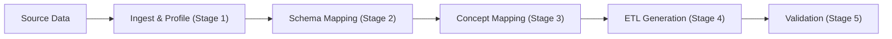

<p align="center">
  
</p>

<h1 align="center">Portiere</h1>

<p align="center">
  <strong>AI-Powered Clinical and Health Data Mapping Tool</strong>
</p>

<p align="center">
  <a href="https://pypi.org/project/portiere-health/"></a>
  <a href="https://pypi.org/project/portiere-health/"></a>
  <a href="https://github.com/Cuspal/portiere/blob/main/LICENSE"></a>
  <a href="https://github.com/Cuspal/portiere/actions"></a>
  <a href="https://github.com/Cuspal/portiere/actions"></a>
  <a href="https://github.com/Cuspal/portiere"></a>
</p>

<p align="center">
  <a href="https://docs.portiere.io">Documentation</a> &middot;
  <a href="#quick-start">Quick Start</a> &middot;
  <a href="https://github.com/Cuspal/portiere/tree/main/docs/notebooks_examples">Examples</a> &middot;
  <a href="https://github.com/Cuspal/portiere/issues">Issues</a>
</p>

---

## What is Portiere?

Mapping clinical data to standard models like **OMOP CDM**, **FHIR R4**, **HL7 v2**, and **OpenEHR** is one of the most time-consuming and error-prone tasks in health informatics. It typically requires domain experts to manually map hundreds of source fields and thousands of clinical codes — a process that can take weeks or months.

**Portiere** automates this with an AI-powered 5-stage pipeline that handles schema mapping, concept mapping, ETL generation, and data quality validation — all running locally on your machine with no cloud dependency required.



Portiere combines **clinical-domain embeddings** (SapBERT as default model), **lexical search** (BM25s), **cross-encoder reranking**, and optional **LLM verification** to achieve high-accuracy mappings with confidence routing — automatically accepting high-confidence results while flagging uncertain ones for human review.

## Key Features

- **Multi-Standard Support** — OMOP CDM v5.4, FHIR R4, HL7 v2.5.1, OpenEHR 1.0.4 (extensible via YAML)
- **AI-Powered Mapping** — SapBERT embeddings + cross-encoder reranking + optional LLM verification
- **9 Knowledge Backends** — BM25s, FAISS, Elasticsearch, ChromaDB, PGVector, MongoDB, Qdrant, Milvus, Hybrid (RRF fusion)
- **BYO-LLM** — Bring your own LLM: OpenAI, Anthropic Claude, AWS Bedrock, Ollama (local)
- **Pluggable Engines** — Polars (default), PySpark / Databricks, Pandas, DuckDB
- **Standalone ETL Artifacts** — Generated ETL scripts run without the SDK
- **Data Quality Validation** — Great Expectations integration for post-ETL checks
- **Confidence Routing** — Auto-accept, needs-review, and manual tiers with human-in-the-loop
- **Cross-Standard Mapping** — Transform between standards (OMOP ↔ FHIR, HL7v2 → FHIR, OMOP → OpenEHR)
- **Local-First** — All processing runs on your machine; no cloud dependency

## Quick Start

### Install

```bash
pip install portiere

# With a compute engine (pick one)
pip install "portiere-health[polars]"    # Lightweight (recommended)
pip install "portiere-health[spark]"     # Large-scale / Databricks
pip install "portiere-health[pandas]"    # Prototyping
```

### Map Clinical Data to OMOP CDM

```python
import portiere
from portiere.engines import PolarsEngine

# Initialize a project
project = portiere.init(
    name="Hospital OMOP Migration",
    engine=PolarsEngine(),
    target_model="omop_cdm_v5.4",
    vocabularies=["SNOMED", "LOINC", "RxNorm", "ICD10CM"],
)

# Add and profile a data source
source = project.add_source("patients.csv")
profile = project.profile(source)

# AI-powered schema mapping (source columns → OMOP tables)
schema_map = project.map_schema(source)

# AI-powered concept mapping (clinical codes → standard concepts)
concept_map = project.map_concepts(codes=["E11.9", "I10", "R73.03"])

# Review mappings
schema_map.summary()
concept_map.summary()

# Generate and run ETL
result = project.run_etl(source, schema_map, concept_map)
```

### Cross-Standard Mapping (OMOP → FHIR)

```python
project = portiere.init(
    name="FHIR Export",
    engine=PolarsEngine(),
    task="cross_map",
    source_standard="omop_cdm_v5.4",
    target_model="fhir_r4",
)
```

## Installation

### Core Package

```bash
pip install portiere
```

### Optional Extras

Install only what you need:

| Category | Extra | Command |
|----------|-------|---------|
| **Engines** | Polars | `pip install "portiere[polars]"` |
| | PySpark | `pip install "portiere[spark]"` |
| | Pandas | `pip install "portiere[pandas]"` |
| | DuckDB | `pip install "portiere[duckdb]"` |
| **LLM Providers** | OpenAI | `pip install "portiere[openai]"` |
| | Anthropic | `pip install "portiere[anthropic]"` |
| | AWS Bedrock | `pip install "portiere[bedrock]"` |
| | Ollama | `pip install "portiere[ollama]"` |
| **Knowledge Backends** | FAISS | `pip install "portiere[faiss]"` |
| | Elasticsearch | `pip install "portiere[elasticsearch]"` |
| | ChromaDB | `pip install "portiere[chromadb]"` |
| | PGVector | `pip install "portiere[pgvector]"` |
| | MongoDB | `pip install "portiere[mongodb]"` |
| | Qdrant | `pip install "portiere[qdrant]"` |
| | Milvus | `pip install "portiere[milvus]"` |
| **Quality** | Great Expectations | `pip install "portiere[quality]"` |
| **Everything** | All extras | `pip install "portiere[all]"` |

> **Requirements:** Python 3.10+

## How It Works

Portiere implements a **5-stage AI pipeline** for clinical data transformation:

### Stage 1: Ingest & Profile

Connects to your data source (CSV, Parquet, databases) and extracts schema metadata — column names, types, cardinality, detected code columns, and PHI indicators.

### Stage 2: Schema Mapping

Maps source columns to target standard entities using a fusion of:
- **Pattern matching** — Regex patterns defined in YAML standard files
- **Embedding similarity** — SapBERT clinical embeddings for semantic matching
- **Cross-encoder reranking** — Precision reranking of top candidates

### Stage 3: Concept Mapping

Maps clinical codes (ICD-10, CPT, local codes) to standard vocabularies (SNOMED CT, LOINC, RxNorm) through:
1. **Direct code lookup** — Exact match in knowledge base
2. **Knowledge layer search** — BM25s lexical / FAISS vector / Hybrid search
3. **Cross-encoder reranking** — Rerank top-k candidates for precision
4. **LLM verification** — Optional AI verification for medium-confidence mappings
5. **Confidence routing** — Auto-accept (>0.95), needs-review (0.70–0.95), manual (<0.70)

### Stage 4: ETL Generation

Generates standalone ETL scripts (Spark, Polars, or Pandas) and lookup tables (CSV) that run **without** the Portiere SDK — no vendor lock-in.

### Stage 5: Validation

Post-ETL data quality checks using Great Expectations, with standards-aware conformance for all supported models (OMOP, FHIR, HL7, OpenEHR, custom YAML):
- **Completeness** — Non-null percentages for required fields
- **Conformance** — Type and constraint compliance derived from YAML field metadata
- **Plausibility** — Domain-specific clinical rules

## Supported Standards

| Standard | Version | Use Case |
|----------|---------|----------|
| **OMOP CDM** | v5.4 | Observational research, population health |
| **FHIR R4** | R4 | Interoperability, health information exchange |
| **HL7 v2** | 2.5.1 | Legacy hospital system integration |
| **OpenEHR** | 1.0.4 | European clinical data, archetype-based EHRs |

Standards are defined as YAML files and are fully extensible — you can define custom hospital CDMs or registry schemas.

### Cross-Standard Mapping

Built-in crossmaps for transforming between standards:

| Source | Target | File |
|--------|--------|------|
| FHIR R4 | OMOP CDM | `fhir_r4_to_omop.yaml` |
| OMOP CDM | FHIR R4 | `omop_to_fhir_r4.yaml` |
| HL7 v2 | FHIR R4 | `hl7v2_to_fhir_r4.yaml` |
| OMOP CDM | OpenEHR | `omop_to_openehr.yaml` |
| FHIR R4 | OpenEHR | `fhir_r4_to_openehr.yaml` |

## Custom Standards

Portiere is not limited to built-in standards. You can define any clinical data model — a hospital CDM, a disease registry schema, a research database, a legacy warehouse — as a YAML file and use it identically to built-in standards.

### Define a Custom Standard (YAML)

Create a `.yaml` file with the following structure:

```yaml
name: "hospital_cdm_v1"
version: "1.0"
standard_type: "relational"
organization: "General Hospital Research"
description: "Internal clinical data model for General Hospital"

entities:
  patients:
    description: "Core patient demographics"
    fields:
      patient_id:
        type: integer
        required: true
        description: "Unique patient identifier"
        ddl: "INTEGER PRIMARY KEY"
      date_of_birth:
        type: date
        description: "Patient date of birth"
        ddl: "DATE NOT NULL"
      sex:
        type: string
        description: "Biological sex (M/F/U)"
        ddl: "VARCHAR(1)"

    # Fast pattern matching: source column name → target field
    source_patterns:
      patient_id: "patient_id"
      subject_id: "patient_id"
      dob: "date_of_birth"
      birth_date: "date_of_birth"
      gender: "sex"
      sex: "sex"

    # Embedding descriptions: optimized text for AI semantic matching
    # Write what a clinician would search for, not just the field name
    embedding_descriptions:
      patient_id: "unique patient identifier number"
      date_of_birth: "patient birth date birthday date of birth"
      sex: "biological sex gender male female M F"

  encounters:
    description: "Hospital visits and admissions"
    fields:
      encounter_id:
        type: integer
        required: true
        description: "Unique encounter identifier"
        ddl: "INTEGER PRIMARY KEY"
      admit_date:
        type: datetime
        description: "Admission date and time"
        ddl: "TIMESTAMP NOT NULL"
      encounter_type:
        type: string
        description: "Type of encounter (inpatient, outpatient, ED)"
        ddl: "VARCHAR(20)"

    source_patterns:
      encounter_id: "encounter_id"
      visit_id: "encounter_id"
      hadm_id: "encounter_id"
      admit_date: "admit_date"
      admittime: "admit_date"
      visit_type: "encounter_type"

    embedding_descriptions:
      encounter_id: "hospital encounter visit admission identifier"
      admit_date: "admission date time when patient was admitted"
      encounter_type: "visit type inpatient outpatient emergency department"
```

### Use Your Custom Standard

```python
import portiere
from portiere.engines import PolarsEngine

# Reference via "custom:" prefix — works anywhere target_model is accepted
project = portiere.init(
    name="Hospital Migration",
    engine=PolarsEngine(),
    target_model="custom:/path/to/hospital_cdm_v1.yaml",
)

source = project.add_source("patients.csv")
schema_map = project.map_schema(source)
concept_map = project.map_concepts(codes=["E11.9", "I10"])
result = project.run_etl(source, schema_map, concept_map)
```

Or load directly for inspection:

```python
from portiere.standards import YAMLTargetModel

model = YAMLTargetModel("/path/to/hospital_cdm_v1.yaml")
print(model.get_schema())      # entity → [fields]
print(model.get_source_patterns())  # source column hints
```

You can also ship your custom standard as a built-in by placing the YAML in `src/portiere/standards/` — it will then be loadable by name:

```python
model = YAMLTargetModel.from_name("hospital_cdm_v1")
```

---

## Column Naming Guide

Portiere's schema mapper uses two strategies in sequence: **exact pattern matching** (fast, zero-cost) then **embedding similarity** (AI-powered). Understanding both helps you get higher auto-accept rates.

### Strategy 1 — Source Patterns (rule-based, highest priority)

Each entity in a standard YAML defines `source_patterns` — a dictionary mapping source column names to target fields. Matches here are always accepted, regardless of confidence score.

Built-in OMOP patterns include common aliases:

| Your column name | Maps to |
|-----------------|---------|
| `patient_id`, `subject_id`, `mrn` | `person.person_id` |
| `dob`, `birth_date`, `date_of_birth` | `person.birth_datetime` |
| `gender`, `sex` | `person.gender_concept_id` |
| `icd_code`, `diagnosis_code`, `dx_code` | `condition_occurrence.condition_source_value` |
| `admit_date`, `admittime` | `visit_occurrence.visit_start_date` |
| `drug_code`, `ndc`, `medication_code` | `drug_exposure.drug_source_value` |

**To maximize pattern hits in your own standard**, add all known aliases to `source_patterns` in your YAML:

```yaml
source_patterns:
  patient_id: "person_id"     # exact name
  pid: "person_id"            # short alias
  subject_id: "person_id"     # research alias
  pt_id: "person_id"          # abbreviated
  medical_record_number: "person_id"  # verbose
```

### Strategy 2 — Embedding Similarity (semantic, AI-powered)

When no pattern matches, the mapper encodes both the source column name and the `embedding_descriptions` into vectors using SapBERT, then finds the closest target field by cosine similarity.

**What to write in `embedding_descriptions`:**

Write natural-language phrases a clinician would use to describe what that column contains — not just a rephrasing of the field name.

```yaml
# ❌ Too literal — just re-states the name
embedding_descriptions:
  admit_date: "admission date"
  dx_code: "diagnosis code"

# ✅ Rich synonyms and clinical context — maximizes semantic recall
embedding_descriptions:
  admit_date: "hospital admission date time when patient was admitted inpatient start"
  dx_code: "ICD diagnosis code ICD-10-CM ICD-9 disease condition clinical code"
```

**Naming your source columns well** also helps. The source column name itself is encoded alongside the description. Prefer descriptive names over cryptic abbreviations:

| Less matchable | More matchable |
|----------------|----------------|
| `col_32` | `diagnosis_code` |
| `dt1` | `admission_date` |
| `flg_act` | `is_active` |
| `cd_race` | `race_code` |
| `proc_nm` | `procedure_name` |

### Confidence Tiers

After matching, every column receives a confidence score:

| Score | Tier | Action |
|-------|------|--------|
| ≥ 0.95 | Auto-accepted | Written to output immediately |
| 0.70 – 0.95 | Needs review | Flagged for human inspection |
| < 0.70 | Manual | Requires explicit override |

Tune these thresholds to match your project's risk tolerance:

```python
from portiere import PortiereConfig, ThresholdsConfig
from portiere.config import SchemaMappingThresholds

config = PortiereConfig(
    thresholds=ThresholdsConfig(
        schema_mapping=SchemaMappingThresholds(
            auto_accept=0.90,   # lower → more auto-accepts
            needs_review=0.60,  # lower → fewer manual items
        )
    )
)
```

### Full Workflow with Review

```python
schema_map = project.map_schema(source)

# Inspect what needs review
for item in schema_map.needs_review():
    print(f"{item.source_column} → {item.target_table}.{item.target_column} "
          f"(confidence={item.confidence:.2f})")
    for c in item.candidates[:3]:
        print(f"  candidate: {c['target_table']}.{c['target_column']} ({c['confidence']:.2f})")

# Approve, override, or reject
schema_map.approve("patient_name")
schema_map.override("pt_zip", target_table="location", target_column="zip")
schema_map.reject("internal_audit_flag")

# Approve all remaining items
schema_map.approve_all()
schema_map.finalize()
```

## Knowledge Layer Backends

| Backend | Type | Dependencies | Best For |
|---------|------|-------------|----------|
| **BM25s** | Lexical | None (built-in) | Quick start, no infra needed |
| **FAISS** | Vector | `faiss-cpu`, `sentence-transformers` | High-accuracy local search |
| **Elasticsearch** | Hybrid | `elasticsearch` | Production deployments |
| **ChromaDB** | Vector | `chromadb` | Lightweight vector store |
| **PGVector** | Vector | `psycopg`, `pgvector` | PostgreSQL environments |
| **MongoDB** | Vector | `pymongo` | Atlas Vector Search users |
| **Qdrant** | Vector | `qdrant-client` | Dedicated vector DB |
| **Milvus** | Vector | `pymilvus` | Large-scale vector search |
| **Hybrid** | Fusion | Varies | Combine backends with RRF |

### Hybrid Search Example

```python
from portiere import PortiereConfig, KnowledgeLayerConfig

config = PortiereConfig(
    knowledge_layer=KnowledgeLayerConfig(
        backend="hybrid",
        hybrid_backends=["bm25s", "faiss"],
        hybrid_fusion="rrf",  # Reciprocal Rank Fusion
    )
)
```

## LLM Providers

Portiere supports **Bring-Your-Own-LLM** for concept verification:

| Provider | Extra | Model Examples |
|----------|-------|---------------|
| **OpenAI** | `portiere[openai]` | GPT-4o, GPT-4o-mini |
| **Anthropic** | `portiere[anthropic]` | Claude Sonnet, Claude Haiku |
| **AWS Bedrock** | `portiere[bedrock]` | Claude, Titan, Llama |
| **Ollama** | `portiere[ollama]` | Llama 3, Mistral, Gemma (local) |

```python
from portiere import PortiereConfig, LLMConfig

config = PortiereConfig(
    llm=LLMConfig(
        provider="openai",
        model="gpt-4o-mini",
        api_key="sk-...",
    )
)
```

## Configuration

Portiere auto-discovers configuration from multiple sources (in priority order):

### 1. Python Objects

```python
from portiere import PortiereConfig, EmbeddingConfig, KnowledgeLayerConfig

config = PortiereConfig(
    target_model="omop_cdm_v5.4",
    embedding=EmbeddingConfig(
        provider="huggingface",
        model="cambridgeltl/SapBERT-from-PubMedBERT-fulltext",
    ),
    knowledge_layer=KnowledgeLayerConfig(backend="bm25s"),
)
```

### 2. YAML File (`portiere.yaml`)

```yaml
target_model: omop_cdm_v5.4
storage: local

embedding:
  provider: huggingface
  model: cambridgeltl/SapBERT-from-PubMedBERT-fulltext

knowledge_layer:
  backend: bm25s

llm:
  provider: openai
  model: gpt-4o-mini

thresholds:
  auto_accept: 0.95
  needs_review: 0.70
```

### 3. Environment Variables

```bash
export PORTIERE_TARGET_MODEL=omop_cdm_v5.4
export PORTIERE_LLM__PROVIDER=openai
export PORTIERE_LLM__API_KEY=sk-...
export PORTIERE_KNOWLEDGE_LAYER__BACKEND=faiss
```

## Building the Knowledge Layer

Before concept mapping, build a searchable index from standard vocabularies (e.g., [OHDSI Athena](https://athena.ohdsi.org/)):

```python
from portiere import build_knowledge_layer, PortiereConfig

config = PortiereConfig()

stats = build_knowledge_layer(
    vocabulary_dir="./data/athena/",
    config=config,
    vocabularies=["SNOMED", "LOINC", "RxNorm", "ICD10CM"],
)

print(f"Indexed {stats['total_concepts']:,} concepts")
```

## Documentation

| Resource | Description |
|----------|-------------|
| [Quick Start Guide](docs/documentations/01-quickstart.md) | Get started in 5 minutes |
| [API Reference](docs/documentations/02-unified-api-reference.md) | Full SDK API documentation |
| [Configuration Guide](docs/documentations/03-configuration.md) | YAML, Python, and env var config |
| [Knowledge Layer Guide](docs/documentations/05-knowledge-layer.md) | All 9 backends explained |
| [LLM Integration](docs/documentations/06-llm-integration.md) | BYO-LLM setup |
| [Pipeline Architecture](docs/documentations/08-pipeline-architecture.md) | 5-stage pipeline deep dive |
| [Multi-Standard Support](docs/documentations/20-multi-standard-support.md) | Standards and custom schemas |
| [Cross-Standard Mapping](docs/documentations/21-cross-standard-mapping.md) | OMOP ↔ FHIR, HL7v2 → FHIR |
| [Example Notebooks](docs/notebooks_examples/) | 19 Jupyter notebooks with walkthroughs |

## Project Structure

```
portiere/
├── src/portiere/
│   ├── __init__.py          # Public API: init(), PortiereProject, configs
│   ├── config.py            # Configuration with auto-discovery
│   ├── project.py           # Unified project interface
│   ├── exceptions.py        # Error hierarchy
│   ├── stages/              # 5-stage pipeline implementation
│   ├── engines/             # Compute engines (Polars, Spark, Pandas, DuckDB)
│   ├── knowledge/           # Knowledge layer backends (9 backends)
│   ├── embedding/           # Embedding providers & gateway
│   ├── llm/                 # LLM providers & gateway
│   ├── local/               # Local AI components (schema mapper, concept mapper)
│   ├── artifacts/           # ETL code generation (Jinja2 templates)
│   ├── runner/              # ETL execution engine
│   ├── quality/             # Data quality validation (Great Expectations)
│   ├── standards/           # Clinical standard YAML definitions & crossmaps
│   ├── storage/             # Storage backends (local filesystem)
│   └── models/              # Pydantic data models
├── tests/                   # 36 test modules, 689 tests
├── docs/
│   ├── documentations/      # 22 guides and references
│   └── notebooks_examples/  # 19 Jupyter notebook examples
├── pyproject.toml           # Package configuration (hatchling)
└── LICENSE                  # Apache 2.0
```

## Star History

<a href="https://star-history.com/#Cuspal/portiere&Date">
 <picture>
   <source media="(prefers-color-scheme: dark)" srcset="https://api.star-history.com/svg?repos=Cuspal/portiere&type=Date&theme=dark" />
   <source media="(prefers-color-scheme: light)" srcset="https://api.star-history.com/svg?repos=Cuspal/portiere&type=Date" />
   
 </picture>
</a>

## Contributing

We welcome contributions! Here's how to get started:

```bash
# Clone the repository
git clone https://github.com/Cuspal/portiere.git
cd portiere

# Create a virtual environment
python -m venv .venv
source .venv/bin/activate

# Install in development mode
pip install -e ".[dev,docs,polars,quality]"

# Run tests
pytest

# Run linter
ruff check src/ tests/

# Run type checker
mypy src/portiere/
```

Please read our contributing guidelines before submitting a pull request.

## License

Portiere is licensed under the [Apache License 2.0](LICENSE).

```
Copyright 2026 Cuspal Co. Ltd.

Licensed under the Apache License, Version 2.0 (the "License");
you may not use this file except in compliance with the License.
You may obtain a copy of the License at

    http://www.apache.org/licenses/LICENSE-2.0
```

## Citation

If you use Portiere in your research, please cite:

```bibtex
@software{portiere2024,
  title     = {Portiere: AI-Powered Clinical Data Mapping SDK},
  author    = {Cuspal Co.,Ltd.},
  year      = {2026},
  url       = {https://github.com/Cuspal/portiere},
  license   = {Apache-2.0},
}
```
