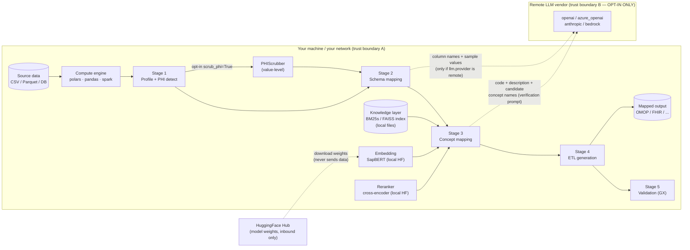

# Data Flow & Threat Model

Companion to [COMPLIANCE.md](https://github.com/Cuspal/portiere/blob/main/COMPLIANCE.md). Written so its sections can be
pasted into a DPIA or a hospital security-review questionnaire.

## 1. Data-flow diagram



**Boundary A → B is the only outbound clinical-data path, and it exists only
when a remote `llm.provider` is configured.** `offline=True` removes it
structurally; `portiere doctor --assert-no-egress` proves its absence.

## 2. Exact egress payloads (BYO-LLM path)

When (and only when) `llm.provider` ∈ {`openai`, `azure_openai`, `anthropic`,
`bedrock`}:

| Stage | Payload sent | Source in code |
|---|---|---|
| Stage 3 concept verification | source code string, its description, candidate concept names/IDs, domain hint | `local/llm_verifier.py` (`CONCEPT_VERIFICATION_PROMPT`, `DISAMBIGUATION_PROMPT`) |
| Stage 2 schema mapping (LLM-assisted path) | column names, inferred types, **sample values** | `stages/stage2_schema.py` |

Mitigations, in order: don't configure a remote LLM (`offline=True` enforces —
this is the guarantee); or use a local `ollama` provider. `scrub_phi=True` is
defence-in-depth for **profile-derived** payloads only: in v0.4.0 the Stage-2
schema-mapping path reads sample values from the raw dataframe and is NOT
covered by the scrubber (wiring planned for v0.4.x — see
[phi-scrubbing.md](phi-scrubbing.md), "Scope in v0.4.0").

## 3. Assets

| Asset | Sensitivity |
|---|---|
| Source clinical data (may contain PHI) | highest |
| Profile artifacts (examples, top values — PHI fragments) | high |
| Mapped outputs (OMOP/FHIR tables) | high |
| Mapping decisions / review files | medium (contain source terms) |
| Athena vocabulary files | licensed content (UMLS/AMA terms), not PHI |
| Model weights cache | public models, not sensitive |

## 4. Actors & threats (STRIDE-abbreviated)

| Threat | Vector | Control |
|---|---|---|
| **Information disclosure — accidental egress** | operator enables a remote LLM without realizing prompts carry data | `portiere doctor` posture report; `offline=True` hard-fail; this document |
| Information disclosure — PHI in artifacts | profile HTML/CSV, review files shared internally carry example values | `scrub_phi=True` (v0.4.0, opt-in); artifact access control (operator) |
| Information disclosure — model-download side channel | HF download reveals *which models* you fetch, never data | pre-download + air-gap (`models download`, then `offline=True`, `--network none`) |
| Tampering — poisoned vocabulary/index | operator loads an untrusted Athena export or index | fetch vocabularies only from athena.ohdsi.org under your UMLS licence; index files are local artifacts of that input |
| Tampering — malicious model weights | HF supply chain | models are pinned by name; pin revisions + local mirror for hardened deployments (operator control) |
| Spoofing / network exposure | Review UI reachable by others | binds `127.0.0.1` by default; `--host 0.0.0.0` is explicit + warned |
| Repudiation — who approved a mapping | review decisions lack actor identity in v0.4.0 | reviewed files are plain JSON under your VCS/audit regime (operator); richer audit is a Cloud/v1.0 concern |
| Elevation | Portiere runs with the operator's privileges; no daemon, no setuid | run as a least-privilege user (operator) |

## 5. Residual risk statement

With `offline=True`, models pre-cached, and network egress blocked at the OS
level, Portiere's remaining attack surface is that of any local Python data
tool processing files the operator already controls: local file permissions and
the integrity of installed packages. There is no server component, no
telemetry, and no credential store.

## 6. Reviewer quick-check

```bash
pip install portiere-health[polars]
portiere doctor --assert-no-egress && echo "no egress possible"
grep -rn "requests\|httpx\|urllib" src/portiere/stages/  # inspect for yourself
```
